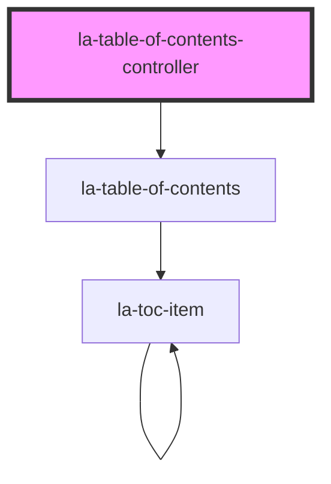

# la-table-of-contents-controller
This component renders `la-table-of-contents` based on data passed to the `items` prop. It provides
the following functionality:
* Search input widget
* Collapse all button and Expand all button widget


<!-- Auto Generated Below -->


## Usage

### Html

### Vanilla HTML JS Implementation
THis example demos the following:
* Passing in data into `items` of `la-table-of-content-controller` via js
* Slot usage

```html
<la-table-of-contents titleFilter='Ch. 2'>
  <span slot='expand-icon'>⬇️</span>
  <span slot='collapse-icon'>⬆️</span>
</la-table-of-contents>
<script>
  const laTocElement = document.querySelector('la-table-of-contents');
  const items = [
    {
      title: 'Entire document',
      children: [
        {
          title: 'Ch. 1 – ',
          children: [
            {
              title: 'Part B',
            },
          ],
        },
        {
          title: 'Ch. 2 – ',
          index: 9,
        },
      ],
    },
  ];
  laTocElement.items = items;
</script>
```

### Basic React example

```js
import React from 'react';
import { LaTableOfContentsController } from '@lawsafrica/law-widgets-react'

const App = () => {
  const items = [
    {
      title: 'Entire document',
      children: [
        {
          title: 'Ch. 1 – ',
          children: [
            {
              title: 'Part B',
            },
          ],
        },
        {
          title: 'Ch. 2 – ',
        },
      ],
    },   
  ]
  return (
    <div>
      <LaTableOfContentsController 
        items={items} 
      />
    </div>
  );
};

export default App;
```

### Basic Vue3 example

```vue

<template>
  <div>
    <LaTableOfContentsController :items="items" />
  </div>
</template>

<script>
import {LaTableOfContentsController} from "@lawsafrica/law-widgets-vue";

export default {
  data: () => ({
    items: [
      {
        title: 'Entire document',
        children: [
          {
            title: 'Ch. 1 – ',
            children: [
              {
                title: 'Part B',
              },
            ],
          },
          {
            title: 'Ch. 2 – ',
          },
        ],
      },
    ]
  }),
  components: {
    LaTableOfContentsController
  }
}
</script>
```

### Component stories
Click [here](https://laws.africa/la-web-components/?path=/docs/library-la-table-of-contents-controller--basic-usage) for more interactive examples on Storybook JS


## Properties

| Property                     | Attribute                        | Description                                                                                                                                                                                                                 | Type                  | Default                          |
| ---------------------------- | -------------------------------- | --------------------------------------------------------------------------------------------------------------------------------------------------------------------------------------------------------------------------- | --------------------- | -------------------------------- |
| `collapseAllBtnClasses`      | `collapse-all-btn-classes`       | Additional classes added to Collapse all button                                                                                                                                                                             | `string`              | `''`                             |
| `expandAllBtnClasses`        | `expand-all-btn-classes`         | Additional classes added to Expand all button                                                                                                                                                                               | `string`              | `''`                             |
| `fetch`                      | `fetch`                          | Fetch content from Laws.Africa services? Requires a Laws.Africa partnership and the frbrExpressionUri property to be set.                                                                                                   | `boolean`             | `false`                          |
| `frbrExpressionUri`          | `frbr-expression-uri`            | Full Akoma Ntoso FRBR Expression URI to fetch TOC information for. Only used if `fetch` is set.                                                                                                                             | `string \| undefined` | `undefined`                      |
| `hideClearTitleFilterButton` | `hide-clear-title-filter-button` | If true, hides clear title filter button                                                                                                                                                                                    | `boolean`             | `false`                          |
| `items`                      | `items`                          | JSON value of array of items or string value parsed to array of items used to build the table of contents. Each item must have a `title` attribute (which may be `null`), and a `children` attribute (which may be `null`). | `TOCItem[] \| string` | `[]`                             |
| `partner`                    | `partner`                        | Partner code to use when fetching content from Laws.Africa. Defaults to the `location.hostname`.                                                                                                                            | `string \| undefined` | `undefined`                      |
| `provider`                   | `provider`                       | Provider URL for fetching content (advanced usage only).                                                                                                                                                                    | `string`              | `PROVIDER`                       |
| `titleFilterClearBtnClasses` | `title-filter-clear-btn-classes` | Additional classes added to title filter button                                                                                                                                                                             | `string`              | `''`                             |
| `titleFilterInputClasses`    | `title-filter-input-classes`     | Additional CSS classes added to the search filter input                                                                                                                                                                     | `string`              | `''`                             |
| `titleFilterPlaceholder`     | `title-filter-placeholder`       | Placeholder for search title filter                                                                                                                                                                                         | `string`              | `'Search the table of contents'` |


## Dependencies

### Depends on

- [la-table-of-contents](../table-of-contents)

### Graph


----------------------------------------------

*Built with [StencilJS](https://stenciljs.com/)*
