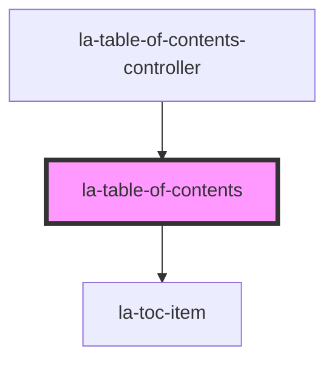

# la-table-of-contents

This component is an interactive table of contents generated from data passed in the `items` prop. The features of
this component are the following:

- Expanding and collapsing table of contents items.
- Viewing table of content items as a tree. Showing all table of content items and nested items if they exist.
- Programmatically filtering table of content items by item `title`.

<!-- Auto Generated Below -->


## Usage

### Html

### HTML-only usage

This example demos how to use la-table-of-contents-controller without Javascript.

- The `items` attribute is a JSON string of the items.

```html
<la-table-of-contents
  items="[{
    title: 'Entire document',
    children: [
      {
        title: 'Ch. 1 – Heading 1',
        children: [
          {
            title: 'Section 1.',
          },
        ],
      },
      {
        title: 'Ch. 2 – Heading 2',
      },
    ],
  }]"
  >
</la-table-of-contents>
```

### Vanilla HTML JS Implementation

This example demos the following:

- Passing in data into `items` of `la-table-of-content` via js
- Slot usage

```html
<la-table-of-contents>
  <span slot="prepend">🏆</span>
  <span slot="append">🥙</span>
</la-table-of-contents>
<script>
  const laTocElement = document.querySelector('la-table-of-contents');
  const items = [
    {
      title: 'Entire document',
      children: [
        {
          title: 'Ch. 1 – Heading 1',
          children: [
            {
              title: 'Section 1',
            },
          ],
        },
        {
          title: 'Ch. 2 – Heading 2',
        },
      ],
    },
  ];
  laTocElement.items = items;
</script>
```

### Basic React example

```js
import React from 'react';
import { LaTableOfContents } from '@lawsafrica/law-widgets-react';

const App = () => {
  const items = [
    {
      title: 'Entire document',
      children: [
        {
          title: 'Ch. 1 – Heading 1',
          children: [
            {
              title: 'Section 1',
            },
          ],
        },
        {
          title: 'Ch. 2 – Heading 2',
        },
      ],
    },
  ];

  return (
    <div>
      <LaTableOfContents items={items} />
    </div>
  );
};

export default App;
```

### Basic Vue3 example

```vue
<template>
  <div>
    <LaTableOfContent :items="{ items }" />
  </div>
</template>

<script>
import { LaTableOfContents } from '@lawsafrica/law-widgets-vue';

export default {
  components: {
    LaTableOfContents,
  },
  data: () => ({
    items: [
      {
        title: 'Entire document',
        children: [
          {
            title: 'Ch. 1 – Heading 1',
            children: [
              {
                title: 'Section 1',
              },
            ],
          },
          {
            title: 'Ch. 2 – Heading 2',
          },
        ],
      },
    ],
  }),
};
</script>
```

### Component stories

Click [here](https://laws.africa/la-web-components/?path=/docs/library-la-table-of-contents--basic-usage) for more interactive examples on Storybook JS


## Properties

| Property            | Attribute             | Description                                                                                                                                                                                                                                                                                                                  | Type                  | Default     |
| ------------------- | --------------------- | ---------------------------------------------------------------------------------------------------------------------------------------------------------------------------------------------------------------------------------------------------------------------------------------------------------------------------- | --------------------- | ----------- |
| `expanded`          | `expanded`            | Should items be expanded by default? This can be overridden by setting the expanded property for individual items.                                                                                                                                                                                                           | `boolean`             | `true`      |
| `fetch`             | `fetch`               | Fetch content from Laws.Africa services? Requires a Laws.Africa partnership and the frbrExpressionUri property to be set.                                                                                                                                                                                                    | `boolean`             | `false`     |
| `frbrExpressionUri` | `frbr-expression-uri` | Full Akoma Ntoso FRBR Expression URI to fetch TOC information for. Only used if `fetch` is set.                                                                                                                                                                                                                              | `string \| undefined` | `undefined` |
| `items`             | `items`               | JSON value or string value parsed to array of items used to build the table of contents. Each item must have a `title` attribute (which may be `null`), and a `children` attribute (which may be `null`).  Items may optionally have an id attribute and an href attribute, which are used to build the links for each item. | `TOCItem[] \| string` | `[]`        |
| `partner`           | `partner`             | Partner code to use when fetching content from Laws.Africa. Defaults to the `location.hostname`.                                                                                                                                                                                                                             | `string \| undefined` | `undefined` |
| `provider`          | `provider`            | Provider URL for fetching content (advanced usage only).                                                                                                                                                                                                                                                                     | `string`              | `PROVIDER`  |
| `titleFilter`       | `title-filter`        | value to filter items by item title                                                                                                                                                                                                                                                                                          | `string`              | `''`        |


## Methods

### `collapseAll() => Promise<void>`

Collapses all items

#### Returns

Type: `Promise<void>`


### `expandAll() => Promise<void>`

Expands all items

#### Returns

Type: `Promise<void>`


## Dependencies

### Used by

 - [la-table-of-contents-controller](../table-of-contents-controller)

### Depends on

- [la-toc-item](../toc-item)

### Graph


----------------------------------------------

*Built with [StencilJS](https://stenciljs.com/)*
