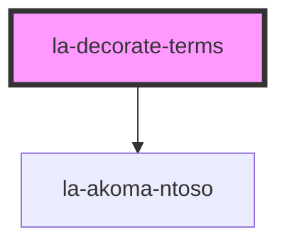

# la-decorate-terms

This is a behaviour element that decorates references to defined terms within an `<la-akoma-ntoso>` element by
making them clickable links, and by showing the definition of the term in a popup.

<!-- Auto Generated Below -->

## Properties

| Property           | Attribute           | Description                                                                                                                                                                              | Type      | Default     |
| ------------------ | ------------------- | ---------------------------------------------------------------------------------------------------------------------------------------------------------------------------------------- | --------- | ----------- |
| `akomaNtoso`       | `akoma-ntoso`       | CSS selector for the la-akoma-ntoso element that will be decorated. Defaults to the containing la-akoma-ntoso element, if any, otherwise the first `la-akoma-ntoso` element on the page. | `string`  | `undefined` |
| `linkTerms`        | `link-terms`        | If `true`, terms will be changed to `<a>` elements that jump to the term definition.                                                                                                     | `boolean` | `false`     |
| `popupDefinitions` | `popup-definitions` | If `true`, the definitions of terms will be shown as popups.                                                                                                                             | `boolean` | `false`     |

## Dependencies

### Depends on

- [la-akoma-ntoso](../la-akn)

### Graph

----------------------------------------------

*Built with [StencilJS](https://stenciljs.com/)*
