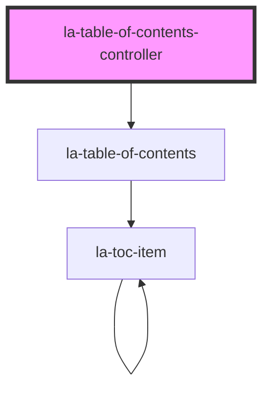

# la-table-of-contents-controller
This component renders `la-table-of-contents` based on data passed to the `items` prop. It provides
the following functionality:
* Search input widget
* Collapse all button and Expand all button widget

<!-- Auto Generated Below -->

## Properties

| Property                 | Attribute                  | Description                                                                                                                                                             | Type        | Default             |
| ------------------------ | -------------------------- | ----------------------------------------------------------------------------------------------------------------------------------------------------------------------- | ----------- | ------------------- |
| `items`                  | --                         | An array of items used to build the table of contents. Each item must have a `title` attribute (which may be `null`), and a `children` attribute (which may be `null`). | `TOCItem[]` | `sampleData`        |
| `titleFilterPlaceholder` | `title-filter-placeholder` | Placeholder for search title filter                                                                                                                                     | `string`    | `"Search by title"` |

## Dependencies

### Depends on

- [la-table-of-contents](../table-of-contents)

### Graph

----------------------------------------------

*Built with [StencilJS](https://stenciljs.com/)*
