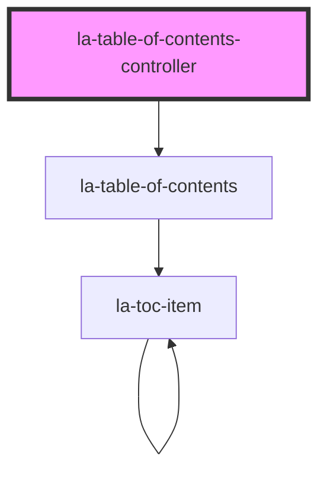

# la-table-of-contents-controller
This component renders `la-table-of-contents` based on data passed to the `items` prop. It provides
the following functionality:
* Search input widget
* Collapse all button and Expand all button widget


<!-- Auto Generated Below -->


## Usage

### Html

## Vanilla HTML JS Implementation
THis example demos the following:
* Passing in data into `items` of `la-table-of-content-controller` via js
* Slot usage
* Filtering via titleQuery

```html
<la-table-of-contents titleFilter='Ch. 2'>
  <span slot='prepend'>🏆</span>
  <span slot='append'>🥙</span>
  <span slot='expand-icon'>⬇️</span>
  <span slot='collapse-icon'>⬆️</span>
</la-table-of-contents>
<script>
  const laTocElement = document.querySelector('la-table-of-contents');
  const items = [
    {
      title: 'Entire document',
      children: [
        {
          title: 'Ch. 1 – ',
          children: [
            {
              title: 'Part B',
            },
          ],
        },
        {
          title: 'Ch. 2 – ',
          index: 9,
        },
      ],
    },
  ];
  laTocElement.items = items;
</script>
```


## Properties

| Property                     | Attribute                        | Description                                                                                                                                                                                                                 | Type                  | Default                          |
| ---------------------------- | -------------------------------- | --------------------------------------------------------------------------------------------------------------------------------------------------------------------------------------------------------------------------- | --------------------- | -------------------------------- |
| `collapseAllBtnClasses`      | `collapse-all-btn-classes`       | Additional classes added to Collapse all button                                                                                                                                                                             | `string`              | `''`                             |
| `expandAllBtnClasses`        | `expand-all-btn-classes`         | Additional classes added to Expand all button                                                                                                                                                                               | `string`              | `''`                             |
| `items`                      | `items`                          | JSON value of array of items or string value parsed to array of items used to build the table of contents. Each item must have a `title` attribute (which may be `null`), and a `children` attribute (which may be `null`). | `TOCItem[] \| string` | `[]`                             |
| `titleFilterClearBtnClasses` | `title-filter-clear-btn-classes` | Additional classes added to title filter button                                                                                                                                                                             | `string`              | `''`                             |
| `titleFilterClearable`       | `title-filter-clearable`         | If true, shows clear title filter button                                                                                                                                                                                    | `boolean`             | `true`                           |
| `titleFilterInputClasses`    | `title-filter-input-classes`     | Additional CSS classes added to the search filter input                                                                                                                                                                     | `string`              | `''`                             |
| `titleFilterPlaceholder`     | `title-filter-placeholder`       | Placeholder for search title filter                                                                                                                                                                                         | `string`              | `'Search the table of contents'` |


## Dependencies

### Depends on

- [la-table-of-contents](../table-of-contents)

### Graph


----------------------------------------------

*Built with [StencilJS](https://stenciljs.com/)*
