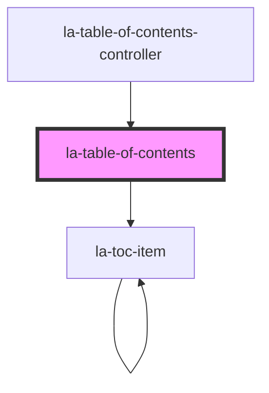

# la-table-of-contents

This component is an interactive table of contents generated from data passed in the `items` prop. The features of
this component are the following:

* Expanding and collapsing table of contents items.
* Viewing table of content items as a tree. Showing all table of content items and nested items if they exist.  
* Programmatically filtering table of content items by item `title`.

<!-- Auto Generated Below -->

## Properties

| Property      | Attribute      | Description                                                                                                                                                             | Type        | Default |
| ------------- | -------------- | ----------------------------------------------------------------------------------------------------------------------------------------------------------------------- | ----------- | ------- |
| `items`       | --             | An array of items used to build the table of contents. Each item must have a `title` attribute (which may be `null`), and a `children` attribute (which may be `null`). | `TOCItem[]` | `[]`    |
| `titleFilter` | `title-filter` | value to filter items by item title                                                                                                                                     | `string`    | `''`    |

## Methods

### `collapseAll() => Promise<void>`

Collapses all items

#### Returns

Type: `Promise<void>`

### `expandAll() => Promise<void>`

Expands all items

#### Returns

Type: `Promise<void>`

## Dependencies

### Used by

 - [la-table-of-contents-controller](../table-of-contents-controller)

### Depends on

- [la-toc-item](../toc-item)

### Graph

----------------------------------------------

*Built with [StencilJS](https://stenciljs.com/)*
