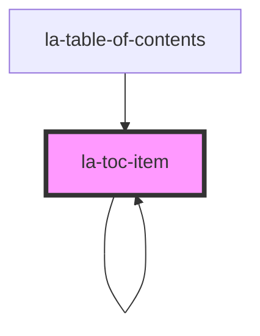

# la-toc-item

<!-- Auto Generated Below -->

## Properties

| Property           | Attribute            | Description                                                                                                                                                                           | Type                   | Default |
| ------------------ | -------------------- | ------------------------------------------------------------------------------------------------------------------------------------------------------------------------------------- | ---------------------- | ------- |
| `appendHtml`       | `append-html`        | HTML displayed after item title                                                                                                                                                       | `string`               | `''`    |
| `collapseIconHtml` | `collapse-icon-html` | HTML displayed in toggle button when item is not expanded                                                                                                                             | `string`               | `''`    |
| `expandIconHtml`   | `expand-icon-html`   | HTML displayed in toggle button when item is expanded                                                                                                                                 | `string`               | `''`    |
| `expanded`         | `expanded`           | If true, `item` `children`, and the collapsed icon are shown but expanded icon is hidden. If false, the `item` `children` and collapsed icon are hidden but the expanded icon is show | `boolean`              | `true`  |
| `filteredItems`    | --                   | Array of items filtered by titleQuery used in la-toc-item to determine with item is shown or not                                                                                      | `Set<TOCItem> \| null` | `null`  |
| `item`             | --                   | Item used to build the table of contents                                                                                                                                              | `TOCItem`              | `{}`    |
| `prependHtml`      | `prepend-html`       | HTML displayed before item title                                                                                                                                                      | `string`               | `''`    |

## Events

| Event            | Description | Type               |
| ---------------- | ----------- | ------------------ |
| `itemRendered`   |             | `CustomEvent<any>` |
| `itemWillRender` |             | `CustomEvent<any>` |

## Dependencies

### Used by

 - [la-table-of-contents](../table-of-contents)
 - [la-toc-item](.)

### Depends on

- [la-toc-item](.)

### Graph

----------------------------------------------

*Built with [StencilJS](https://stenciljs.com/)*
